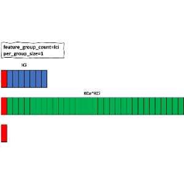

# GroupedConv2D FF/BPI/BPK算子设计文档

修订记录

| 版本 | 描述                             | 时间       | 作者    |
| ---- | -------------------------------- | ---------- | ------- |
|      | 初版                             | 2021.05    | Jian.Da |
|      | 修改dim<65536限制；增加BPK设计； | 2021.07.15 | Jian.Da |
|      |                                  |            |         |


## 1     设计背景

**XLA ConvND Semantic **

| **Arguments**         | **Type**                         | **Semantics**                    |
| --------------------- | -------------------------------- | -------------------------------- |
| `lhs`                 | `XlaOp`                          | rank n+2 array of inputs         |
| `rhs`                 | `XlaOp`                          | rank n+2 array of kernel weights |
| `window_strides`      | `ArraySlice<int64>`              | n-d array of kernel strides      |
| `padding`             | `ArraySlice< pair<int64,int64>>` | n-d array of (low, high) padding |
| `lhs_dilation`        | `ArraySlice<int64>`              | n-d lhs dilation factor array    |
| `rhs_dilation`        | `ArraySlice<int64>`              | n-d rhs dilation factor array    |
| `feature_group_count` | int64                            | the number of feature groups     |
| `batch_group_count`   | int64                            | the number of batch groups       |

**XLA全语义的2D卷积***

rhs_dilation
$$
[N,IH,IW,IC]\ *\ [R,S,KCi,KCo]\ =\ [N,OH,OW,OC]\\
IC\ =\ KCI\ *\ feature\_group\_count\\
OC\ =\ KCo\ /\ feature\_group\_count\\
OH=\frac{(IH+Pad_{Top}+Pad_{Bottom}-R-(R-1)*(D_{H}-1))}{S_{H}}+1\\
OW=\frac{(IW+Pad_{Left}+Pad_{Right}-S-(S-1)*(D_{W}-1))}{S_{W}}+1
$$

lhs_dilation
$$
[N,IH,IW,IC]\ *\ [R,S,KCi,KCo]\ =\ [N,OH,OW,OC]\\
IC\ =\ KCI\ *\ feature\_group\_count\\
OC\ =\ KCo\ /\ feature\_group\_count\\
OH=\frac{(IH+Pad_{Top}+Pad_{Bottom}-R+(IH-1)*(D_{H}-1))}{S_{H}}+1\\
OW=\frac{(IW+Pad_{Left}+Pad_{Right}-S+(IW-1)*(D_{W}-1))}{S_{W}}+1
$$

根据如上公式和Mem限制确定L1/L2中的切分pattern。

**Standard Convolution**


**Depthwise Convolution**

***cm = 1***


***cm != 1***


```
tf.api:  [N,H,W,C]* [R,S,C,2] = [N,H,W,2C]
xla_hlo: [N,H,W,C]* [R,S,1,2C] = [N,H,W,2C]
%convolution.6 = f16[32,110,110,64]{3,2,1,0} convolution(f16[32,112,112,32]{3,2,1,0} %arg0.1, f16[3,3,1,64]{3,2,1,0}     %bitcast), window={size=3x3}, dim_labels=b01f_01io->b01f, feature_group_count=32, metadata={op_type="DepthwiseConv2dNative|convolution" op_name="depthwise|convolution"}
```

The difference between "tf-ir" and "hlo-ir" indicates “channel_multiplier” works as Co in semantic of Conv2D(GeneralPadding).

**Grouped Convolution**

​                                 

Both Standard Conv2D and Depthwise Conv2D can be interpreted by Grouped Conv2D.

<center class="half">
    
    
      
    <br>
    <div style="color:orange; border-bottom: 1px solid #d9d9d9;
    display: inline-block;
    color: #999;
    padding: 2px;">Typical Case of Feature_Group_Count(Conv2D)
    </div>
 </center>
Generally

```
[N,Hi,Wi,FG,C] * [R,S,C,FG,Co] = [N,Ho,Wo,FG,Co]
```

Example of group convolution in Alexnet


## 2     Feature specification

根据前面XLA的描述和分析，以及sip 2.0能支持的操作，该算子的实现特性描述如下：

- 支持数据类型为f32, f16, bf16(暂不支持s32, s16, s8, u32, u16, u8)

- 支持Input/Output数据格式：NHWC/NCHW (transpose other formats)

- 支持Kenrel格式：RS(KCi)(KCo)/RS(KCo)(KCi) (transpose other formats)

  

- Kernel : 1 <= {R, S} <= 13

- Stride : 1 <= {Sh, Sw} <= 13

- Dilation : 1 <= {Dh, Dw} <= 13

- Pad :  slide times of window >= 1

- PadValue : 0

- 支持operands维度：4(2+2)

- 支持扩展精度实现（使用f32实现f16,bf16中间操作）


- 支持1c1s --> 1cns --> 4cns --> ncns

- 支持pull mode下任意维度处理

- 支持每个维度的大小< 65536

- 精度影响

  o  fp32 log (RxSxKCi) x 1e-4

  o  fp16 log (RxSxKCi) x 1e-2

  o  bf16 log (RxSxKCi) x 5e-2


- 算子实现采用factor集成到lib/ops中，上接hlir，下接factor

- 支持sip2.0多个target（Pavo and Dorado）

- 提供python/hlir/tops api端测试接口

- 预留fusion接口input x output

## 3     概要设计

当前Feature需要考虑满足条件的多种{RS, Stride, Dialation{L,R}, Pad}组合，这些attr都是都是作用在HW维度，利用维度上的解耦才可能实现通过泛化实现。主要考虑VMM/SVMM和VMAC(可以独立于滑窗属性)指令实现支持当前Feature。对于一些无法找到独立滑窗维度乘加的pattern(KCi很小)，可以考虑滑窗维度的乘加关系。

在FF(BPI共用同样的数据流)的设计中，假设BatchSize为1，不作为SMR并行的列维度。在BPK中，N可以假设16的倍数，可以作为SMR并行的列维度。

### 3.1 Sip Kernel设计

VMM/SVMM指令需要VR的行和SMR的列之间存在对应元素乘加求和的关系，然后在SMR的行维度(独立维度Co、N)上并行。

```
乘加关系存在于 
1. reduce维度 ：ICi & KCi(独立于滑窗属性) 
2. window维度 : Wi & S
3. 混合维度 ：Wi-ICi & S-KCi
```

***case 0 :  NHWC  general*** (KCi比较大的时候可以复用conv_gen生成的代码)

Input:       [N,Hi,Wi,ICi]       ===>>>    [N,Hi,Wi,FG, ICi/FG]

Kernel:     [R,S,KCi,KCo]     ===>>>    [R,S,KCi,FG,KCo/FG]

1.这种pattern类似于Standard Conv2D下Ci较大的情况，DMA H2L时需要在ICi上作切分(切分的数据在一个group之内)。

<center class="half">
   
    
    <br>
    <div style="color:orange; border-bottom: 1px solid #d9d9d9;
    display: inline-block;
    color: #999;
    padding: 2px;">XVMM Examples of Feature_Group_Count=ICi(Conv2d S=3 KCi=16)
    </div>
 </center>
$$
vr0 = [ICi0,ICi1,ICi2,ICi3,ICi4,ICi5,.......,ICi15]\\
smr0 =  \left\{
 \begin{matrix}[kci_0,kco_{x:x+32}],\\
[kci_1,kco_{x:x+32}],\\
[kci_2,kco_{x:x+32}],\\
[kci_3,kco_{x:x+32}],\\
[kci_4,kco_{x:x+32}],\\
[kci_5,kco_{x:x+32}],\\
[....],\\
[kci_{15},kco_{x:x+32}],\\
\end{matrix}
  \right\}\\ 
VMM.32b.v16.m16x32.v1m1\ \ dacc0, vr0, smr0
$$

2.对于卷积，如果L1/L2的memory仍未饱和，可以多切Ci让DMA每次饱和搬运。对于Group Conv2D，也可以跨group切ICi和KCo(N,Hi,Wi,2*KCi)(R,S,KCi,2*KCo/feature_group_count)，然后在sip内用两个thread计算两组卷积，但是SMR矩阵需要补0实现CI方向的Pad16功能。


$$
vr0 = [ICi0,ICi1,ICi2,ICi3,ICi4,ICi5,.......,ICi14,ICi15]\\
smr0 =  \left\{
 \begin{matrix}[kci_0,kco_{x:x+32}],\\
[kci_1,kco_{x:x+32}],\\
[kci_2,kco_{x:x+32}],\\
[kci_3,kco_{x:x+32}],\\
[kci_4,kco_{x:x+32}],\\
[....],\\
[kci_{14},kco_{x:x+32}],\\
[0],\\
\end{matrix}
  \right\}\\ 
VMM.32b.v16.m16x32.v1m1\ \ dacc0, vr0, smr0
$$
***case 1 : NHWC small KCi and big S***(不适合dilation)

```
Input : [N,H,W,FG,KCi] 
Kernel : [R,S,Ci,FG,KCo/FG]
(e.g. KCi = 2, S=3)
```

Wi 和KCI无法合并，如果需要使用image conv，需要tranpose FG to 高维。

<center class="half">
    
    <br>
    <div style="color:orange; border-bottom: 1px solid #d9d9d9;
    display: inline-block;
    color: #999;
    padding: 2px;">XVMM Examples of Feature_Group_Count=ICi(Conv2d Rx3)
    </div>
 </center>


$$
vr0 = [wi_{0}Ci_{0},wi_{0}Ci_{1},wi_{1}Ci_{0},wi_{1}Ci_{1},.......,wi_{15}Ci_{0},wi_{15}Ci_{1}]\\
smr0 =  \left\{
 \begin{matrix}[s_{0}kci_0,kco_{x:x+32}],\\
[s_{0}kci_1,kco_{x:x+32}],\\
[s_{1}kci_0,kco_{x:x+32}],\\
[s_{1}kci_1,kco_{x:x+32}],\\
[s_{2}kci_0,kco_{x:x+32}],\\
[s_{2}kci_1,kco_{x:x+32}],\\
[0,kco_{x:x+32}],\\
[0,kco_{x:x+32}],\\
\end{matrix}
  \right\}\\ 
VMM.32b.v8.m8x16.v1m2\ \ dacc0, vr0, smr0
$$

***case 2 :  NCHW general***

big KCI :  transpose every splited unit to NHWC in csb or sip by slice_reshape and then goto case0.

***case 3: NCHW small KCI and big S***

- transpose to NCHW in csb or sip by slice_reshape,

  merge dim Wi/S and Ci as vmm's reduce dim, then Implement like case 1.

  not merge Wi/S, then Implement like following KCi == 1.

- 如果KCi == 1， 可以对 vr(wi)、 smr(s, kco)进行VMM计算。

  transpose [N,H,W,FG,1] to [N,FG,H,W]
  
  transpose [R,S,1,FG,KCo/FG] to  [R,FG,S,KCo/FG]
  
  <center class="half">
      
      <br>
      <div style="color:orange; border-bottom: 1px solid #d9d9d9;
      display: inline-block;
      color: #999;
      padding: 2px;">XVMM Examples of 5X5 and small KCi
      </div>
   </center>
  

**VMAC指令支持场景**

depthwise conv2d属于上述Case1的情况（ICi可能较大，KCi=1，切KCo / FG(CM)也很小）。

- SVMM(wi, {s, CM}) : 通常模型中CM很小，且泛化较难。

- VMAC(ICi, KCo/FG) : (CM==1,否则需要 tranpose filter最低维的CM到非最低维度)。

  <center class="half">
     
      
      <br>
      <div style="color:orange; border-bottom: 1px solid #d9d9d9;
      display: inline-block;
      color: #999;
      padding: 2px;">CM = 1 CM=2	
      </div>
   </center>

```
for wo in range(0,Wo,8):
	for ho in range(0,Ho):
	// pipeline
		for r in range(R):
			for s in range(S):
				calc each window's input addr offset
				vld lhs_vr0-7, rhs_vr 
				vacc0-7 = VMAC(lhs_vr0-7, rhs_vr)
				calc each window's output addr offset
				vst vacc0-7
				
cycles : n*ho*wo*co*R*S*5
```

**Dilation处理**

- 对于容易处理的{RS, Stride, Dialation, Pad}组合，可以将一个RxS卷积拆解成Lhs_Dilation_R*Lhs_Dilation_S个sub卷积（在kernel上以step=dilation采样，每次采样的step=Dilation-Stride，共采样dilation次）。

  

  这种方法需要对pad的情况分情况考虑，共lhs_dilation_h x lhs_dilation_w种。

- 对于复杂的{RS, Stride, Dialation, Pad}组合，在D2C时搬运有效数据，并在C2S时在对其作pad操作，将其转化为{RS, Stride, Rhs_Dilation}组合，实现功能支持。

**BPI **

- Kernel Reverse can be merged into sip process by vld kernel data or not.
- Kernel Layout Change

**BPK**

group convolution仅仅是在ICI和KCo上将卷积分组对应计算，只要将各group数据之间的data layout区分开，对应的bpk的实现逻辑同标准卷积的BPK实现。

- group conv2d bpk(按正向来看变量名)

  {N,H,W,BG,KCi} * {N,H,W,BG,(KCo/BG)} ===>>> {R,S,KCi,KCo}

  - VMM(N, {N,KCo/BG}) or VMM(N, {N,KCi})

- depthwise conv2d bpk

  {N,H,W,BG,1} * {N,H,W,BG,1,CM} ===>>> {R,S,1,BGxCM}

  - VMM(N, {N,CM_16}) :  transpose lhs to {H,W,BG,N} , rhs to {H,W,BG,N, CM_16};  

  - VMAC(BG, BG) : transpose rhs to {N,H,W,CM,BG}
  
  
  ```
  1.确定{R,S}上的切分{r,s}
  2.for each {r,s}, 确定最小的sip_lhs/sip_rhs的切分。
  ```
  
  

### 3.2 Dataflow 设计

**根据数据流选择计算模式**

当前实现仅支持NHWC/NCHW两种Format，其它Format会根据transpose的cost和pattern适合的实现case来选择transpose到哪一种Format。对于每一种sip计算逻辑，需要为其设计尽量合适的data flow。

**FF/BPI**

- 对于KCi较大的pattern，可以将每个group内的feature单独处理且不影响DMA效率和VMM计算效率，并参考按照现有Standard Conv2D的数据流，然后复用已有的conv_gen代码(case 0 2)

  ```
  principle：
  优先保证R,S维度全切，尽量多切KCi,Hi/Wi(overlap in H/W)维度数据。通过VMM指令ICi和KCi乘加，在KCo维度上并行。
  ```

- 对于KCi较小的pattern(影响DMA效率,不影响Sip计算效率)，可以用对Reduce个数要求较小的mode实现XVMM计算(case 0 1)

  ```
  principle：
  NHWC
  方法1：R/S/KCi维度全切，在ICi上只切一份KCi，尽量多切Hi、Wi、Co。(NHWC下DMA效率低)
  方法2：R/S/KCi维度全切，尽量多切ICi维度数据(KCi*sliced_feature_group_count)。在sip内按照case0中公式的形式填充SMR矩阵。
  input slice: 
  [N, Hi, Wi, ICi] ===>>> [a,b,c,0:sliced_feature_group_count*KCi]
  kernel slice:
  [R*S,KCi,KCo] ===>>> [0:R*S,0:KCi,0:sliced_feature_group_count,0:KCo/Cg]
  每一份KCi和[R*S,0:KCi,::1,0:32]计算得到结果后DMA L2H
  
  NCHW
  1.if choose VMM ICi and KCi, transpose format of lhs to HWC
  2.if choose SVMM Wi and S, no tranpose needed but SMR should be filled by skipping every KCi as following.
  ```

  $$
  vr0 = [wi_{0},wi_{1},wi_{3},.......,wi_{15}]\\
  smr0 =  \left\{
   \begin{matrix}[r_{0}kci_0,kco_{x:x+32}],\\
  [r_{1}kci_0,kco_{x:x+32}],\\
  [r_{2}kci_0,kco_{x:x+32}],\\
  [0,kco_{x:x+32}],\\
  \end{matrix}
    \right\}\\ 
  VMM.32b.v4.m4x16.v1m4\ \ dacc0, vr0, smr0
  $$

- 对于kci==1且S较大的pattern，可以通过Wi和S乘加求和，然后用在KCo上parallel(case 1 3)

  ```
  principle:
  优先切HiWi维度，ICi维度的切分使得DMA高效即可。
  ```

- 对于kci==1的pattern，KCi很大的pattern,可以通过VMAC实现(case 4)

  ```
  principle:
  ICi维度的切分由DMA效率决定，然后优先在HW维度切分。
  ```

**BPK**


## 4. 详细设计

### 4.1 HLIR 接口

### 4.2 Factor 接口

Dataflow采用factor开发，使用pull mode，dma的各项操作在sip内部完成。


## 5. Non4C support

|               | N    |  Hi  |  Wi  | ICi  |  R   |  S   | KCi  | KCo  |  N   |  Ho  |  Wo  | OCo  |
| :-----------: | ---- | :--: | :--: | :--: | :--: | :--: | :--: | :--: | :--: | :--: | :--: | :--: |
| split_support | √    |  -   |  -   |  -   |  -   |  -   |  -   |  -   |  √   |  -   |  -   |  -   |
|   split_num   | 4    |      |      |      |      |      |      |      |  4   |      |      |      |


## 6. 测试用例设计

### 6.1 场景测试

Verify patterns of depthwise-conv2d and group-conv2d arising in the typical network and other odd patterns：

- all dims small

- all dims large
- asymmetrical window/stride/dialation/input
- etc. 

### 6.2 性能测试

Test patterns of depthwise-conv2d and group-conv2d arising in the typical network on zebu.

## 7. Roadmap

2021.06.01-2021.06.30  handle depthwise conv2d as a special case of group conv2d.

......

